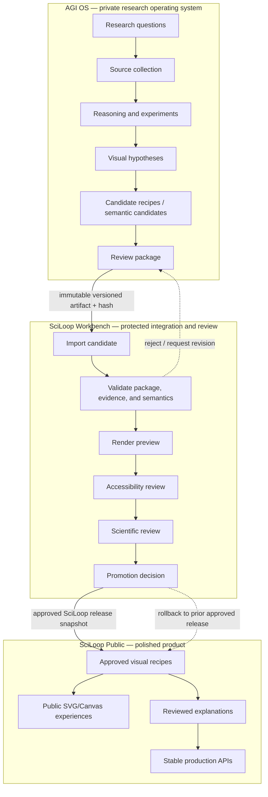
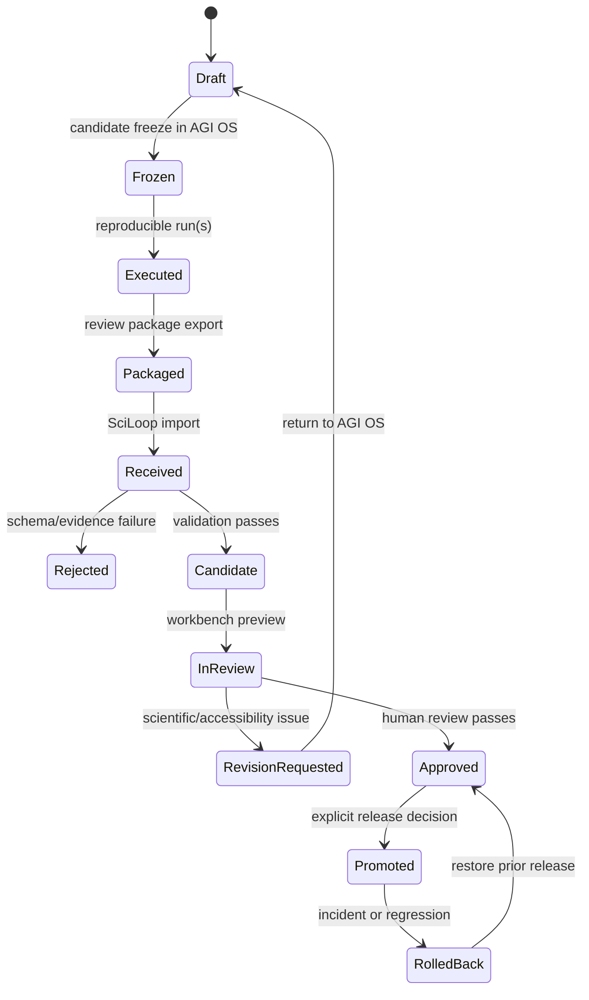

# AGI OS ↔ SciLoop System Map

Status: architecture proposal; this map describes responsibilities and the proposed artifact boundary. It does not add a runtime integration.

## End-to-end map



## Requested responsibility view

```text
AGI OS
├── research questions
├── source collection
├── reasoning and experiments
├── visual hypotheses
├── candidate recipes
└── review package
          ↓
SciLoop Workbench
├── import candidate
├── validate recipe
├── render preview
├── accessibility review
├── scientific review
└── promotion decision
          ↓
SciLoop Public
├── approved visual recipes
├── public SVG/Canvas experiences
├── reviewed explanations
└── stable production APIs
```

## Boundary contract

The downward arrows represent artifacts, not shared runtime state:

```text
AGI OS export
  ├── schema version
  ├── artifact id and content hash
  ├── research question and understanding goal
  ├── frozen candidate / experiment / run provenance
  ├── evidence and source references
  ├── semantic nodes and directed edges
  ├── assumptions, risks, unknowns, falsifiers
  └── visual hypothesis expressed as primitives

SciLoop import
  ├── schema and size validation
  ├── evidence/reference validation
  ├── mapping to PredictiveVisualPackage
  ├── deterministic VisualRecipe compilation
  ├── fallback and accessibility requirements
  └── immutable review record
```

AGI OS must not send executable renderer code, provider keys, raw database credentials, private notes, or arbitrary instructions for SciLoop to execute. SciLoop must not call AGI OS during public rendering.

## Current repository mapping

| Map area | AGI OS evidence | SciLoop evidence | Status |
| --- | --- | --- | --- |
| Research questions | Cognitive lab `Problem`, research workspace, frontier modules | Evidence briefs and possibility inputs | Existing on both sides; bridge mapping required |
| Source collection | Intelligence source registry and ingest routes | Sources/evidence fields in possibilities and predictive packages | Existing on both sides; provenance normalization required |
| Reasoning and experiments | `Candidate`, `CandidateGraph`, freeze/run/history, protocol reports | Deterministic possibility pipeline and experiment/workbench routes | Separate systems; exchange frozen evidence only |
| Visual hypotheses | AGI OS visual-engine builder and SciLoop Flow primitives | Visual Engine patterns and recipe contracts | Existing concepts; no shared export contract yet |
| Candidate recipes | AGI OS candidates are graph/experiment candidates | `PredictiveVisualPackage` and `VisualRecipe` | Recommended adapter target |
| Review package | AGI OS reports, ship-check, evidence classifications | SciLoop validators, fallbacks, capability registry | Split responsibility; preserve both review records |
| Workbench import | No existing cross-repo import endpoint found | Workbench routes and API handlers exist | Proposed new protected capability |
| Public promotion | Not an AGI OS responsibility | `workbench` → `main`, capability statuses, shipping boundary | Existing SciLoop release process |

## Proposed artifact lifecycle



## Runtime topology

```text
AGI OS deployment
  Next.js 15 + APIs
  Prisma/PostgreSQL
  frontier intelligence cron
  private authentication
          │
          │ proposed scoped export/pull; asynchronous and optional
          ▼
Immutable artifact store or reviewed repository artifact
          │
          │ protected workbench import
          ▼
SciLoop workbench deployment
  Next.js 16 + API routes
  PredictiveVisualPackage validator
  deterministic VisualRecipe compiler
  renderer and review surfaces
          │
          │ approved build snapshot only
          ▼
SciLoop public deployment
  preserved /sciloop-live portal
  reviewed physics and visual-language slices
  stable public APIs
```

## Review gates represented by the map

1. AGI OS candidate is frozen and reproducible.
2. The review package distinguishes observed, measured, inferred, simulated, hypothesis, and unknown claims.
3. SciLoop validates package structure and all references.
4. SciLoop compiles semantics deterministically; no upstream renderer code is executed.
5. The workbench preview has a readable fallback and accessible labels.
6. A scientific reviewer confirms wording, evidence, assumptions, units, and uncertainty.
7. A product/accessibility reviewer confirms the public experience and performance budget.
8. A named release decision promotes a versioned capability.
9. The previous approved release remains available for rollback.

## What the map deliberately excludes

- Direct AGI OS database access from SciLoop.
- Public requests that synchronously call AGI OS.
- Automatic promotion from model confidence or structural scores.
- Shared user sessions or shared provider credentials.
- Executable code generation crossing the artifact boundary.
- Existing legacy portal assets, backend services, or public routes being moved or replaced.

## Open questions shown by the map

- Which artifact store and retention policy should hold the immutable review package?
- What authenticated service identity, if any, will export or pull artifacts?
- Should SciLoop send review feedback back as a new AGI OS research event, or remain one-way initially?
- Which AGI OS candidate fields are authoritative for evidence, and which require SciLoop reclassification?
- Which public capability IDs and routes are eligible for promotion?
